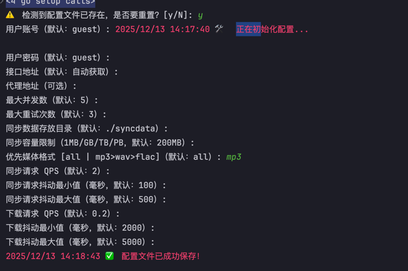
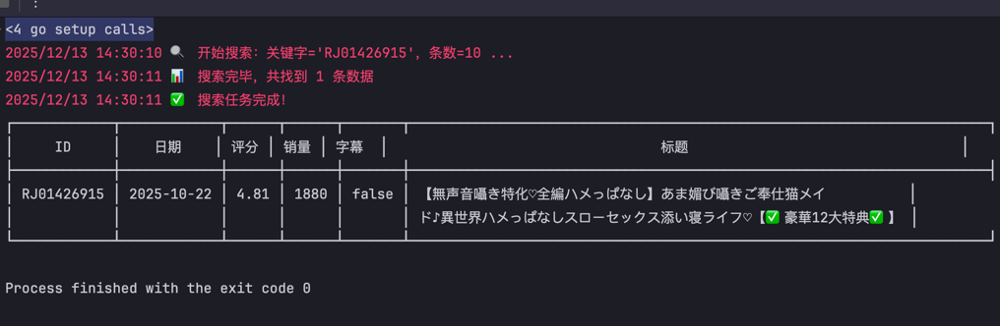
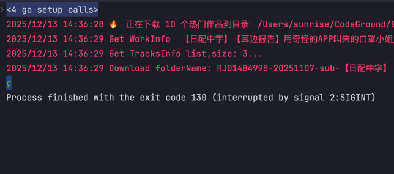
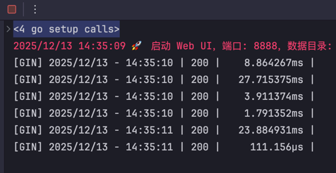
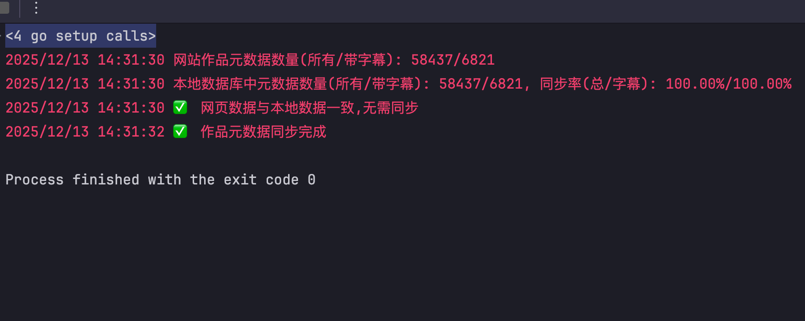
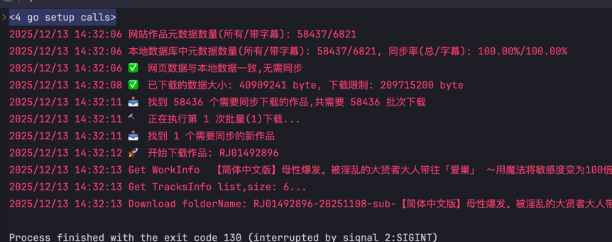
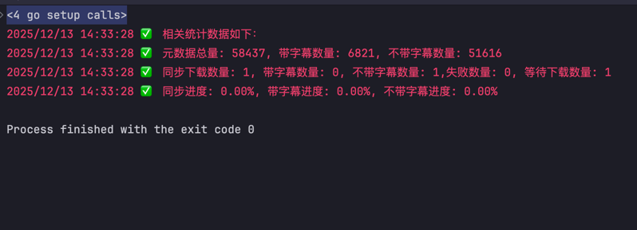
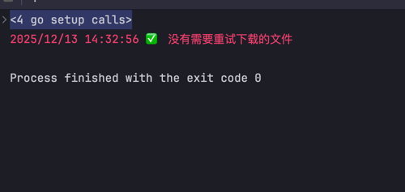

## 📖 项目简介

ASMRoner是一款基于Go语言开发的多功能命令行工具，专注于音声作品的搜索、下载、同步。它提供了直观的命令行接口和简单的Web界面，支持高级搜索语法、批量下载、状态跟踪以及统计分析等功能，为ASMR爱好者提供高效便捷的作品下载体验。

## ✨ 功能特性

### 🔍 搜索功能
- 支持单个RJID搜索
- 支持批量RJID搜索（逗号分隔）
- 支持高级搜索语法（关键字过滤、排除词、时长限制等）
- 搜索结果可导出为CSV/JSON格式
- 搜索并下载功能一体化

### 📥 下载功能
- 单个RJID下载
- 批量RJID下载
- 热门作品下载（hot100模式）
- 搜索结果直接下载
- 自定义下载目录
- 自动处理请求调度、限流、重试机制

### 🔄 同步功能
- 元数据同步与管理
- 批量下载控制
- 下载状态跟踪（完成、失败、等待）
- 失败任务重试
- 同步进度统计
- 下载数据导出

### 🎨 Web界面
- 可视化浏览下载作品
- 浏览器内直接播放音频
- 响应式设计，适配不同设备
- 内嵌资源加载，无需额外配置

### ⚙️ 配置管理
- 交互式配置初始化
- 支持覆盖已有配置
- 丰富的配置选项（账号、限流、目录等）
- 配置文件自动管理

### 📊 统计与报告
- 作品元数据统计
- 下载状态统计
- 同步进度分析
- 详细的下载日志

## 🚀 快速开始

### 安装方法

1. **克隆项目**
```bash
git clone https://github.com/fireinrain/asmroner.git
cd asmroner
```

2. **安装依赖**
```bash
go mod download
```

3. **构建项目**
```bash
go build -o asmroner
```

4. **初始化配置**
```bash
./asmroner config
```

### 基本使用

```bash
# 查看帮助信息
./asmroner --help

# 搜索作品
./asmroner search "护士"

# 下载单个作品
./asmroner download RJ01037721

# 下载热门作品
./asmroner download hot100 -n 10

# 启动Web界面
./asmroner listen
```

## 📋 命令详解

### 🔧 config - 配置管理

```bash
# 初始化或重置配置
./asmroner config
```

交互式配置流程，包含以下选项：
- 用户账号与密码
- API接口地址
- 代理服务配置
- 最大并发数与重试次数
- 同步数据目录
- 下载容量限制
- 优先媒体格式
- QPS限流设置
- 请求抖动配置

配置文件路径：`~/.asmroner/config.toml`

### 🔍 search - 搜索命令

```bash
# 基本搜索
./asmroner search "护士" -c 20

# 高级搜索语法(和asmr.one的高级搜索类似,只不过去掉了前后$,多条件用,代替)
./asmroner search "护士,-中出@duration:1h" -c 50

# 搜索并下载
./asmroner search download "护士" -d ./downloads -s 20

# 搜索并导出
./asmroner search export "护士" -n 100 -f data.json
```

#### 选项说明：
- `-c, --count`：搜索结果数量（默认10）

#### 子命令：
- `download`：搜索并下载
    - `-d, --dir`：下载目录
    - `-s, --size`：下载数量（默认100）
- `export`：搜索并导出
    - `-f, --file`：导出文件名（支持.csv/.json）
    - `-n, --num`：导出数量（默认100）

### 📥 download - 下载命令

```bash
# 单个RJID下载
./asmroner download RJ01037721 -d ./downloads

# 批量RJID下载
./asmroner download RJ01037721,RJ01037722,RJ01037723 -d ./downloads

# 热门作品下载
./asmroner download hot100 -n 20 -d ./downloads
```

#### 选项说明：
- `-d, --dir`：下载保存目录（默认当前目录）
- `-n, --number`：热门模式下载数量（仅hot100模式有效）

### 🔄 sync - 同步命令

```bash
# 查看同步命令帮助
./asmroner sync --help

# 同步下载作品
./asmroner sync download --folder ./downloads

# 重试失败的下载
./asmroner sync retry --folder ./downloads

# 导出下载记录
./asmroner sync export --status failed --file ./failed_downloads.csv

# 查看统计报告
./asmroner sync report
```

#### 子命令：
- `download`：同步下载作品
- `retry`：重试失败下载
- `export`：导出下载记录
- `report`：查看统计报告

### 🎨 listen - Web界面

```bash
# 启动Web界面
./asmroner listen -p 8080

# 指定数据目录
./asmroner listen -p 8080 ./syncdata
```

#### 选项说明：
- `-p, --port`：服务器端口（默认9999）

启动后访问：`http://localhost:9999`

### 📊 version - 版本信息

```bash
# 查看版本信息
./asmroner version
```

## ⚙️ 配置文件

配置文件采用TOML格式，默认位于`~/.asmroner/config.toml`。以下是主要配置项：

```toml
# 用户账号配置
[account]
user = "guest"
password = "guest"

# API配置
[api]
url = "https://api.example.com"

# 下载配置
[downloader]
sync_data_folder = "./syncdata"
max_size = 10737418240  # 10GB
worker_count = 3
prefer_format = "mp3"

# 限流配置
[limiter]
sync_qps = 2
sync_jitter_min = 100
sync_jitter_max = 500
download_qps = 0.2
download_jitter_min = 2000
download_jitter_max = 5000
```

## 📁 项目结构

```
asmroner/
├── cmd/                # 命令行接口
│   ├── config.go      # 配置命令
│   ├── download.go    # 下载命令
│   ├── listen.go      # Web服务
│   ├── root.go        # 根命令
│   ├── search.go      # 搜索命令
│   └── sync.go        # 同步命令
├── internal/          # 内部包
│   ├── consts/        # 常量定义
│   ├── database/      # 数据库操作
│   ├── engine/        # 核心引擎
│   ├── logger/        # 日志记录
│   ├── model/         # 数据模型
│   └── utils/         # 工具函数
├── syncdata/          # 同步数据存储目录
├── webui/             # Web界面
├── .asmroner-data/    # 配置和数据库
├── go.mod             # Go模块定义
├── go.sum             # 依赖校验和
├── main.go            # 程序入口
└── version.go         # 版本信息
```

## 🛠 技术栈

| 技术/组件 | 用途 |
|---------|------|
| Go语言  | 后端开发 |
| GORM    | ORM框架 |
| SQLite  | 数据库存储 |
| Cobra   | 命令行框架 |
| Viper   | 配置管理 |
| Gin     | Web框架 |
| Tailwind CSS | Web界面样式 |
| Plyr    | Web音频播放器 |

## 📊 数据模型

### MetadataWork（作品元数据）

| 字段名 | 类型 | 描述 |
|-------|------|------|
| ID | int | 主键ID |
| Title | string | 作品标题 |
| CircleID | int | 发布者ID |
| Name | string | 作品名称 |
| Nsfw | bool | 是否为成人内容 |
| Release | string | 发布日期 |
| DlCount | int | 下载次数 |
| Price | int | 价格 |
| ReviewCount | int | 评论数 |
| RateCount | int | 评分人数 |
| RateAverage2Dp | float64 | 平均评分（2位小数） |
| HasSubtitle | bool | 是否有字幕 |
| CreateDate | string | 创建日期 |
| Vas | string | 声优信息 |
| Tags | string | 标签 |
| Duration | int | 时长 |
| SourceType | string | 源类型 |
| SourceID | string | 源ID |

### WorkSyncInfo（同步信息）

| 字段名 | 类型 | 描述 |
|-------|------|------|
| ID | int | 主键ID |
| MetadataWorkId | int | 关联的元数据ID |
| SourceId | string | 源ID |
| DirSize | int64 | 目录大小 |
| Status | string | 状态（PENDING/COMPLETED/FAILED） |
| FilePath | string | 本地保存路径 |
| FailReason | string | 失败原因 |
| RetryCount | int | 重试次数 |
| FailedAt | time.Time | 最后失败时间 |

## 🔧 常见问题

### 1. 配置文件未找到

**问题**：启动命令时提示"配置文件未找到 (config.toml)"

**解决方案**：运行`./asmroner config`初始化配置文件

### 2. 下载失败

**问题**：下载任务失败，显示错误信息

**解决方案**：使用`sync retry`命令重试失败的下载任务，或查看日志文件`download_errors.log`获取详细错误信息

### 3. Web界面无法访问

**问题**：无法访问`http://localhost:9999`

**解决方案**：确保程序正在运行，检查配置文件中的端口设置，或使用`-p`选项指定端口

### 4. 搜索结果为空

**问题**：搜索返回空结果

**解决方案**：检查查询语法是否正确，尝试简化搜索条件，或检查网络连接

### 5. 使用样图











## 🤝 贡献指南

我们欢迎社区贡献！如果您想为ASMRoner做出贡献，请按照以下步骤：

1. Fork项目
2. 创建您的特性分支 (`git checkout -b feature/AmazingFeature`)
3. 提交您的更改 (`git commit -m 'Add some AmazingFeature'`)
4. 推送到分支 (`git push origin feature/AmazingFeature`)
5. 开启一个Pull Request

## 📄 许可证

本项目采用MIT许可证，详情请查看LICENSE文件。

## 🙏 致谢

感谢所有为ASMRoner项目做出贡献的开发者和用户！

---

**ASMRoner** - 每天晚上都有不同的妹妹陪你入睡:)

*最后更新：2025年12月*
        