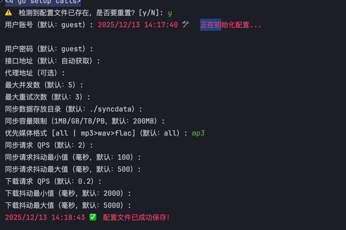
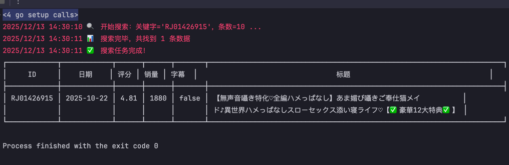
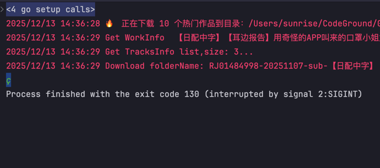
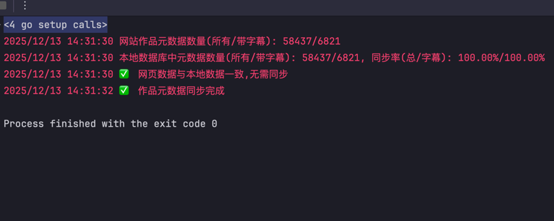
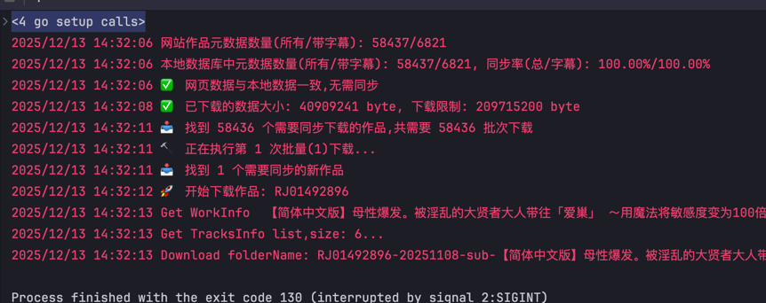
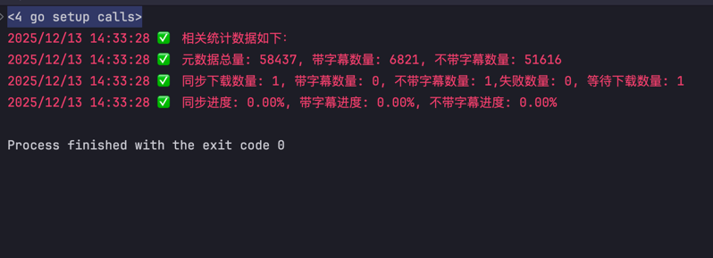
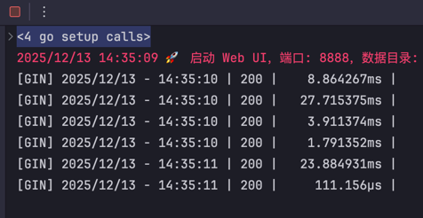
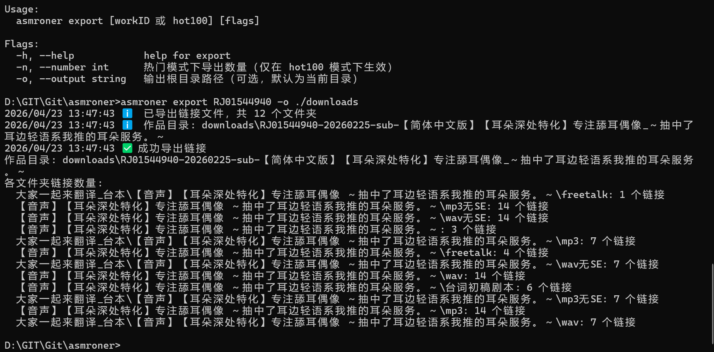
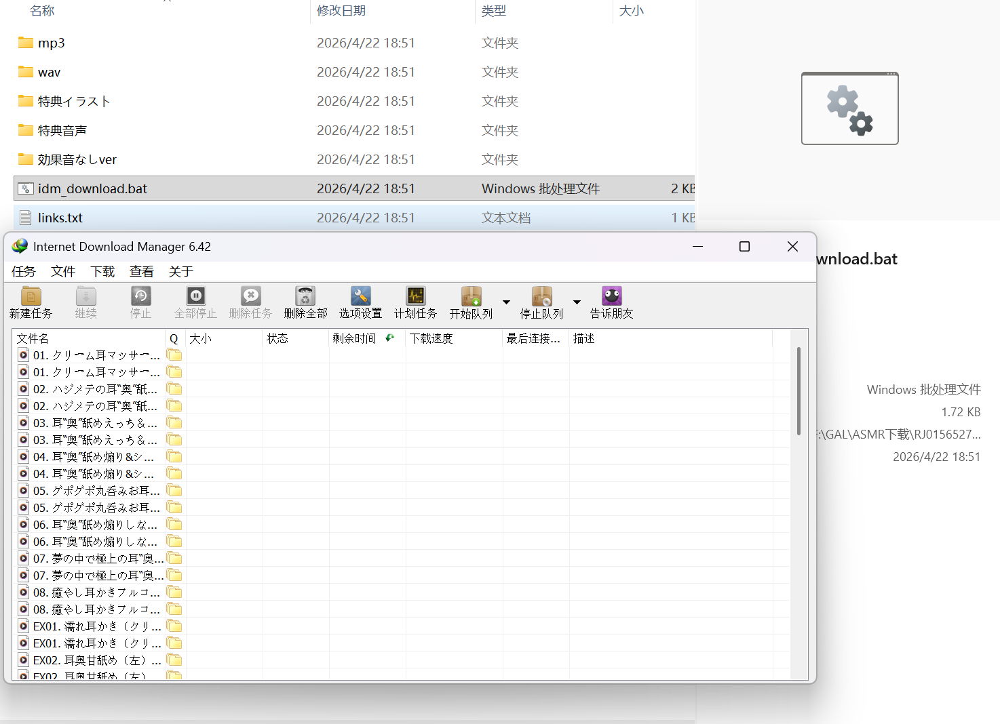

<div align="right">
  <a href="README.en.md">English</a> | <b>简体中文</b>
</div>


## 📖 项目简介

ASMRoner 是一款 Go 语言命令行工具，用于搜索、下载、同步 asmr.one 音声作品，并提供简易 Web 播放界面。

> 🌐 衍生作品：[asmr.furina.in](https://asmr.furina.in) — 一个简洁干净的在线 ASMR 听音页面

## 🚀 快速开始

### 1. 克隆并编译

```bash
git clone https://github.com/MIKANOoOo/asmr-downloader.git
cd asmroner
go build -o asmroner
```

### 2. 初始化配置

```bash
./asmroner config
```

进入交互式配置向导，按提示填写。下面是最关键的几项说明：

| 配置项 | 说明 |
|--------|------|
| **用户账号 / 用户密码** | **asmr.one 网站的登录账号和密码**。如果没有注册过，直接回车使用默认值 `guest` / `guest` 即可正常使用 |
| API 接口地址 | 留空即可，程序会自动探测最快的站点 |
| 代理地址 | 如无需代理直接回车跳过；支持 `http://`、`https://`、`socks5://`（含认证） |
| 同步数据存放目录 | 下载文件的保存位置，默认 `./syncdata` |
| 同步容量限制 | 控制 sync download 的总下载量上限，如 `200MB`、`2GB` |

> 💡 其余选项均可直接回车使用默认值，后续也可以重新运行 `./asmroner config` 修改。

### 3. 开始使用

```bash
./asmroner search "护士" -c 10        # 搜索作品
./asmroner download RJ01037721        # 下载指定作品
./asmroner listen -p 8080 ./syncdata  # 启动 Web 播放界面
```

## 📋 常用命令

```bash
# 查看版本
./asmroner version

# 搜索
./asmroner search "护士" -c 20
./asmroner search "护士,-中出@duration:1h" -c 50

# 下载
./asmroner download RJ01037721 -d ./downloads
./asmroner download RJ01037721,RJ02000001 -d ./downloads
./asmroner download hot100 -n 10 -d ./downloads

# 搜索 + 下载/导出
./asmroner search download "护士" -d ./downloads -s 20
./asmroner search export "护士" -n 100 -f data.json

# 同步元数据 & 批量下载
./asmroner sync
./asmroner sync download -d ./downloads
./asmroner sync retry -d ./downloads
./asmroner sync report

# 导出作品下载链接（生成 links.txt + Aria2/IDM 下载脚本）
./asmroner export RJ01544940 -o ./downloads
./asmroner export hot100 -n 20 -o ./downloads

# Web 播放界面
./asmroner listen -p 8080 ./syncdata
```

## 📸 截图

| 配置 | 搜索 |
|:---:|:---:|
|  |  |
| **下载** | **同步** |
|  |  |
| **同步下载** | **统计** |
|  |  |
| **Web 界面** | **Web 界面 2** |
|  |  |
| **export 界面** | **export 界面 2** |
|  |  |

<details>
<summary><b>✨ 功能特性</b></summary>

- **搜索**：单个/批量 RJID、高级搜索语法（标签/社团/声优/时长/评分/价格/销量/年龄/语言等过滤）、搜索结果分页自动合并、结果导出 CSV/JSON
- **下载**：单个/批量/热门作品下载，支持音频格式优先级（mp3>wav>flac）、扩展名白名单/黑名单过滤，自动限流、重试、指数退避、Worker Pool 并发控制
- **导出**：导出作品下载链接列表，每个作品生成 `links.txt` + `idm_download.bat` + `aria2_download.sh`，支持单作品和热门榜批量导出
- **同步**：全量元数据同步（含同步率统计）、容量感知批量下载控制、状态跟踪（PENDING/COMPLETED/FAILED）、失败重试（清空旧目录重新下载）、CSV/JSON 导出同步状态
- **Web 界面**：可视化浏览、浏览器内音频播放、分页 API、自动打开浏览器、优雅关闭
- **配置**：交互式初始化，支持代理（HTTP/SOCKS5，含认证）、令牌桶限流 + 随机抖动、自定义目录命名格式（{rjid} {date} {subtitle} {title}）、IDM 路径配置
- **站点探测**：自动获取 asmr.one 最新可用域名和最快响应 API 地址（多源 fallback）
- **版本信息**：内置版本号、构建时间、作者信息（支持 ldflags 编译注入）

</details>

<details>
<summary><b>🔍 高级搜索语法</b></summary>

支持 asmr.one 完整搜索语法，格式：`关键词,排除词@过滤条件?分页参数`

**过滤条件**（`@` 之后，逗号分隔，前缀 `-` 表示反选）：

| 条件 | 格式 | 说明 |
|------|------|------|
| tag | `tag:内射/中出` | 按标签筛选（支持 `/` 多值） |
| circle | `circle:社团名` | 按社团筛选 |
| va | `va:声优名` | 按声优筛选 |
| duration | `duration:1h` | 时长大于指定值 |
| rate | `rate:4.5` | 评分大于指定值 |
| price | `price:1000` 或 `-price:2000` | 价格筛选（反选=小于） |
| sell | `sell:500` | 销量大于指定值 |
| age | `age:adult` | 年龄分级 |
| lang | `lang:JPN` 或 `-lang:JPN` | 语言筛选/排除 |

**分页参数**（`?` 之后，`&` 分隔）：

| 参数 | 说明 | 可选值 |
|------|------|--------|
| order | 排序字段 | release / dl_count / rate_average_2dp / review_count / price / id / nsfw |
| sort | 排序方向 | desc / asc |
| subtitle | 字幕筛选 | 0（全部）/ 1（仅含字幕） |
| page | 页码 | 正整数 |
| pageSize | 每页条数 | 正整数 |

**示例**：
```bash
# 搜索含"护士"，排除"中出"，时长>1小时，按下载量排序
./asmroner search "护士,-中出@duration:1h?order=dl_count&sort=desc" -c 50

# 搜索特定声优、含字幕的成人向作品
./asmroner search "@va:陽向葵ゅか,age:adult?subtitle=1" -c 20
```

</details>

<details>
<summary><b>⚙️ 配置文件说明</b></summary>

配置文件路径：`.asmroner-data/config.toml`（TOML 格式）

```toml
[user]
account = "guest"
password = "guest"

[downloader]
api_url = ""                # 留空自动获取最快站点（多源探测 fallback）
proxy_url = ""              # 支持 http / https / socks5（含用户名密码认证）
max_workers = 5             # 并发 Worker 数
max_retries = 3             # 下载失败最大重试次数
sync_data_folder = "./syncdata"
sync_wanted_size = "200MB"  # 同步容量限制（支持 MB/GB/TB/PB）
prefer_media = "all"        # 音频格式优先级：all | mp3>wav>flac
include_ext = ""            # 扩展名白名单，如 ".mp3,.png,.jpg"（只下载命中的，留空不筛选）
exclude_ext = ""            # 扩展名黑名单，如 ".mp4,.webm"（排除命中的，留空不过滤）
                            # 精确后缀匹配，支持嵌套扩展名：
                            # ".vtt" 匹配所有字幕文件
                            # ".mp3.vtt" 只匹配 mp3 的字幕文件
folder_name_format = ""     # 下载目录命名格式，占位符: {rjid} {date} {subtitle} {title}
                            # 留空使用默认格式: {rjid}-{date}-{subtitle}-{title}
idm_path = ""               # IDM 安装路径（可选，用于 export 命令生成下载脚本）

[limit]
sync_qps = 2                # 同步元数据 QPS
sync_jitter_min = 100       # 同步请求最小随机抖动（ms）
sync_jitter_max = 500       # 同步请求最大随机抖动（ms）
download_qps = 0.2          # 下载 QPS
download_jitter_min = 2000  # 下载请求最小随机抖动（ms）
download_jitter_max = 5000  # 下载请求最大随机抖动（ms）
```

</details>

<details>
<summary><b>📋 命令选项速查</b></summary>

| 命令 | 选项 | 说明 |
|------|------|------|
| `version` | — | 显示版本号、构建时间、开发者信息 |
| `config` | — | 交互式初始化或重置配置文件 |
| `search` | `-c` | 搜索结果数量（默认 10，自动分页合并） |
| `search download` | `-d`, `-s` | 下载目录、下载数量（默认 100） |
| `search export` | `-f`, `-n` | 导出文件名（.csv/.json），导出数量（默认 100） |
| `download` | `-d`, `-n` | 下载目录、hot100 模式下载数量 |
| `export` | `-o`, `-n` | 输出目录、hot100 模式导出数量 |
| `sync` | — | 仅同步元数据（自动比对本地/远端，显示同步率） |
| `sync download` | `-d` | 同步后按容量限制逐批下载，含状态跟踪 |
| `sync retry` | `-d` | 清空旧目录后重试下载失败的作品 |
| `sync export` | `-s`, `-f` | 状态筛选（failed/success），导出文件名（.csv/.json） |
| `sync report` | — | 打印下载统计数据（总数/完成/失败/待处理） |
| `listen` | `-p` | Web 播放界面端口（默认 9999），支持分页 API |

</details>

<details>
<summary><b>📁 项目结构</b></summary>

```
asmroner/
├── main.go             # 程序入口，注册 version 命令
├── cmd/                # 命令行接口（config/download/export/search/sync/listen）
├── internal/
│   ├── engine/        # 核心引擎（限流、重试、并发控制、导出脚本生成、站点探测）
│   ├── logger/        # 结构化日志系统
│   ├── model/         # 数据模型、查询参数解析、配置结构
│   ├── database/      # SQLite 数据库（GORM）
│   ├── consts/        # 常量定义（API 路径、正则、User-Agent）
│   └── utils/         # 工具函数（文件命名、目录大小、CSV/JSON 导出）
├── webui/             # 内嵌 Web 界面（Gin + 内嵌静态资源）
├── version.go         # 版本信息（ldflags 注入）
└── go.mod
```

</details>

<details>
<summary><b>🛠 技术栈</b></summary>

| 组件 | 用途 |
|------|------|
| Cobra + Viper | CLI 框架 + 配置管理（TOML） |
| GORM + SQLite | 数据持久化 |
| Resty + golang.org/x/net/proxy | HTTP 客户端（支持 HTTP/HTTPS/SOCKS5 代理） |
| Pond | 并发工作池 |
| golang.org/x/time/rate | 令牌桶限流 + 随机抖动（SmartLimiter） |
| Gin | Web 服务 |
| embed | 内嵌前端静态资源 |

</details>

<details>
<summary><b>🔧 常见问题</b></summary>

**配置文件未找到** → 运行 `./asmroner config` 初始化配置

**下载失败（stream error / connection reset 等）** → 程序会自动重试（指数退避）；若仍失败，使用 `./asmroner sync retry -d <目录>` 重试，或查看 `.asmroner-data/download_errors.log`

**Web 界面无法访问** → 确认端口未被占用，尝试 `-p` 指定其他端口

**搜索结果为空** → 检查查询语法，尝试简化条件；可使用 `./asmroner search "RJ01037721"` 测试单个 RJID

**导出链接后如何下载** → export 命令会在每个作品目录的 `download_scripts/` 下生成 `idm_download.bat`（Windows）和 `aria2_download.sh`（跨平台），以及各文件夹中的 `links.txt`

**同步时提示"本地数据存在逻辑错误"** → 检查 SQLite 数据库是否存在重复数据，可删除 `.asmroner-data/asmroner.db` 后重新同步

**如何自定义下载目录名** → 在 `config.toml` 中配置 `folder_name_format`，支持占位符 `{rjid}` `{date}` `{subtitle}` `{title}`，如 `{rjid}-{title}`

</details>

## 🤝 贡献

欢迎提交 Pull Request！Fork → 新建分支 → 提交更改 → 开启 PR。

## 📄 许可证

本项目采用 MIT 许可证，详情请查看 [LICENSE](/LICENSE) 文件。

## 🙏 致谢

- 特别感谢 [go-asmr-spider](https://github.com/DiheChen/go-asmr-spider)
- 感谢所有贡献者和用户！

---

**ASMRoner** — 每天晚上都有不同的妹妹陪你入睡 :)

*最后更新：2025 年 7 月*